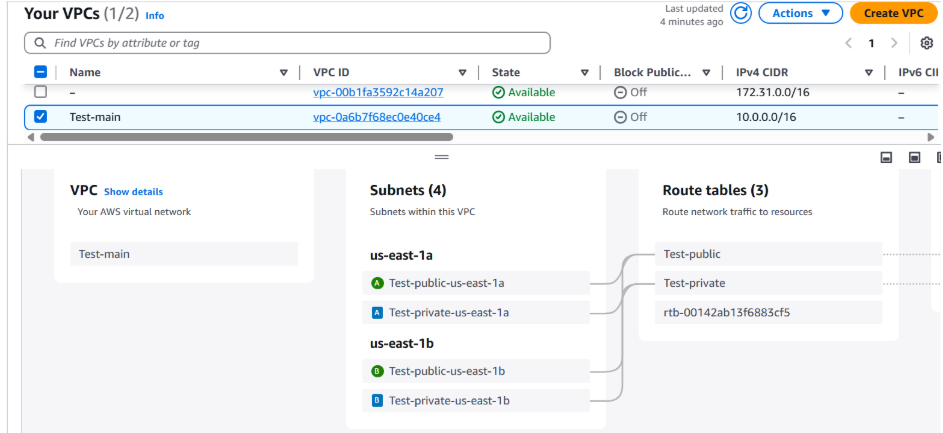
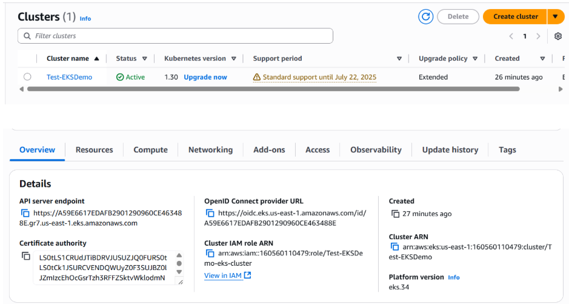
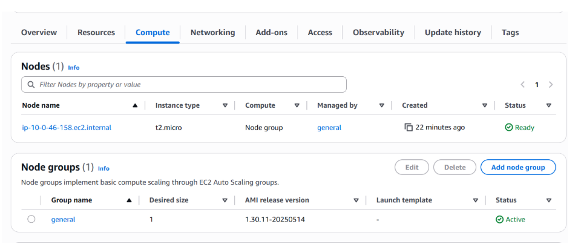
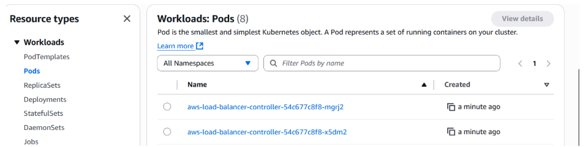
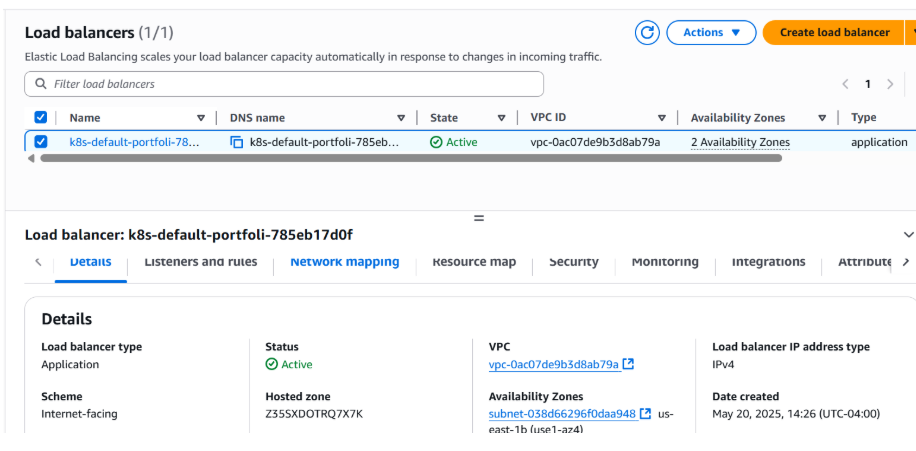

# Deploying Application on AWS EKS with ALB Ingress

## Part 1: Infrastructure Creation of EKS Cluster (Terraform)

To deploy an EKS cluster in AWS, the following networking components are required,

- Creation of VPC with four different subnets (two public and two private) in two different availabilty zones because EKS requires multiple subnets at least in two different availability zones.
- Private subnets to deploy kubernetes nodes and public subnets to provision network and load balancer.
- Internet gateway attached to VPC to provide internet access to the virtual machines with public IP in the public subnets.
- NAT Gateway in one of the public subnets which translates the private IP address to public that allows internet access within the private subnets.
- Route table - Public Route (Target - Internet Gateway), Private Route (Target - NAT Gateway) and attach these to the subnets.

### 1. EKS_Terraform

- locals.tf - locals block defines values for environment, region, availability zones, and EKS cluster details.
- provider.tf - Configures the AWS provider, which allows Terraform to interact with AWS services.
- vpc.tf - Declares a Terraform resource of type aws_vpc.
- igw.tf - Creates an AWS Internet Gateway (IGW) and attaches it to your VPC.
- subnets.tf - 2 Private Subnets: For internal resources (e.g., EKS worker nodes), 2 Public Subnets: For internet-facing resources (e.g., load balancers, NAT Gateways). These subnets are spread across 2 Availability Zones (AZs) (local.zone1 and local.zone2) for high availability.
- nat.tf - Allows private subnet resources to securely access the internet, an Elastic IP (EIP) is a static, public IPv4 address that you can allocate to your AWS account.
- route.tf - Two route tables (public and private) and associates subnets with them to control traffic flow.
- eks.tf - Configuration for the EKS cluster, IAM role, and associated policies.
- nodes.tf - Configures IAM roles, policies, and an EKS node group for worker nodes in your Kubernetes cluster.
- backend.tf - Configuration to store the state file in backend.
- remote-state.tf - Configuration of S3 bucket and DynamoDB table.

### 2. Prerequisites

- AWS CLI
- Terraform
- Helm
- EKSCTL

### 3. Configure AWS CLI and terraform

```bash
aws configure
terraform init
terraform plan
terraform apply
```

### 4. VPC and Subnets in AWS Console



### 3. EKS Cluster and Worker Node in AWS Console




## Part 2: Application: App Deployment, Service, Ingress (Kubernetes Manifests), ALB using Helm.

### 1. Prerequisites

- Create an application using any language.
- Create a Dockerfile.
- Build Docker Image and push into DockerHub.

### 2. Configure Access to the EKS Cluster

```bash
aws eks update-kubeconfig --name <cluster_name> --region <region_name>
```

### 3. Deploy the Application (kubernetes)

```bash
kubectl apply -f deployment.yaml
kubectl apply -f service.yaml
kubectl apply -f ingress.yaml
```

### 4. Verify Resources

```bash
kubectl get deployments
kubectl get svc
kubectl get ingress
```

### 5. Configure and associate IAM OIDC Provider

```bash
eksctl utils associate-iam-oidc-provider --cluster <cluster_name> --approve
aws iam list-open-id-connect-providers #Verify the OIDC provider
```

### 6. Download and install the AWS Load Balancer Controller (ALB Ingress Controller) (For Windows)

```bash
Invoke-WebRequest -Uri "https://raw.githubusercontent.com/kubernetes-sigs/aws-load-balancer-controller/v2.11.0/docs/install/iam_policy.json" -OutFile "iam_policy.json"
```

### 7. Create the IAM policy in AWS

```bash
aws iam create-policy --policy-name AWSLoadBalancerControllerIAMPolicy --policy-document file://iam_policy.json
```

### 8. Create IAM Role for the ALB Controller

```bash
eksctl create iamserviceaccount --cluster=<cluster-name> --namespace=kube-system --name=aws-load-balancer-controller --attach-policy-arn=arn:aws:iam::<Account_ID>:policy/AWSLoadBalancerControllerIAMPolicy --approve --override-existing-serviceaccounts
```

### 9. Deploy the Controller

```bash
kubectl apply -k "github.com/aws/eks-charts/stable/aws-load-balancer-controller/crds?ref=master"

helm repo add eks https://aws.github.io/eks-charts

helm install aws-load-balancer-controller eks/aws-load-balancer-controller -n kube-system
 --set clusterName=<cluster_name> \
 --set serviceAccount.create=false \
 --set serviceAccount.name=aws-load-balancer-controller
 --set region=<region> \
 --set vpcId=<your-vpc-id>
```

### 10. Verify that the deployments are running.

```bash
kubectl get deployment -n kube-system aws-load-balancer-controller
```



### 11. Access the Application

```bash
kubectl get ingress

kubectl get ingress <ingress_name> -o jsonpath='{.status.loadBalancer.ingress[0].hostname}'
```



### References:

1. https://registry.terraform.io/providers/hashicorp/aws/latest
2. https://docs.aws.amazon.com/eks/latest/userguide/what-is-eks.html
3. https://www.youtube.com/playlist?list=PLiMWaCMwGJXkYKFa_x0Ch38uznuv-4c3l
4. https://www.youtube.com/watch?v=RRCrY12VY_s
